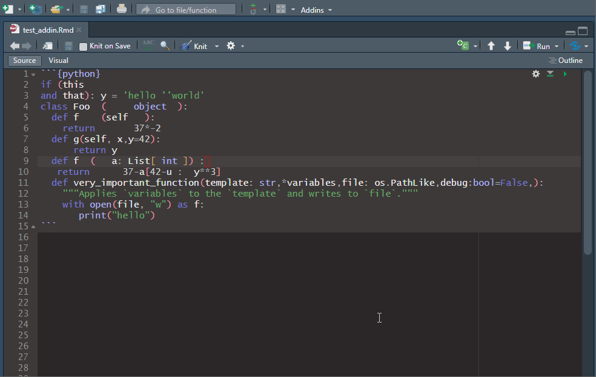

<!-- README.md is generated from README.Rmd. Please edit that file -->

```{r, include = FALSE}
knitr::opts_chunk$set(
  collapse = TRUE,
  comment = "#>",
  fig.path = "man/figures/README-",
  out.width = "100%"
)
```

# pyblack

<!-- badges: start -->
[](https://github.com/erictleung/pyblack/actions/workflows/R-CMD-check.yaml)
[](https://project-types.github.io/#toy)
<!-- badges: end -->

Style Python code blocks with [black](https://github.com/psf/black) in RStudio.



## Installation

```r
remotes::install_github("erictleung/pyblack")
```

You must have black installed and accessible in your path for this addin to
work.

```bash
pip install black
```

## Usage

This addin supports styling with black by:

- highlighted selected code
- entire active file in RStudio

**For select code**, in your text editor, first highlight the relevant Python
code you wish to format. Then navigate in RStudio to Addins > PYBLACK > Style
selection with black.

**For formatting an entire active document**, in your text editor, have your
cursor in an open document you want to format. Then navigate in RStudio to
Addins > PYBLACK > Style active file with black.

## Configuration

In your working directory, you can have a `pyproject.toml` file that `black`
will read.

Below is an example `pyproject.toml` file that changes the line-length from the
default of 88 to 80.

```
[tool.black]
line-length = 80
```

Other settings available to change can be found by running `black --help`.

You can read more about this
[here](https://black.readthedocs.io/en/stable/usage_and_configuration/the_basics.html#configuration-format).


## Conditionally apply formatting

There are two ways to tell black to apply formatting to a code block:

1. Use `# fmt: off` before a block of code
2. Use `black = FALSE` in chunk options

For example, black won't format the `custom_formatting` object, but will format
the `black_formatting` object.

```python
# fmt: off
custom_formatting = [
    0,  1,  2,
    3,  4,  5,
    6,  7,  8,
]
# fmt: on
black_formatting = [
    0,  1,  2,
    3,  4,  5,
    6,  7,  8,
]
```

Another way to avoid formatting an entire code block is to set `black = FALSE`
in the code chunk.

````{verbatim}
```{python, black = FALSE}

```
````

## License

MIT
